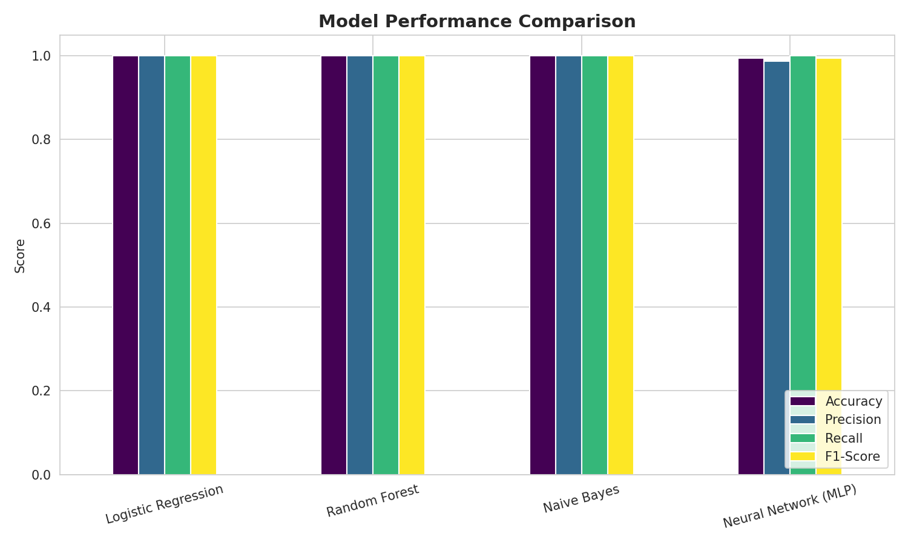

# Phishing Email Detection using NLP

AI-driven system that classifies emails as **phishing** or **legitimate** using NLP and machine learning. Built during the IICT AI/ML Summer Internship.

## Problem

Phishing emails trick people into giving up passwords, bank details, or personal information by mimicking trusted senders and creating false urgency (e.g. "your account will be suspended"). Traditional spam filters rely on blacklists or fixed keyword rules, which can't keep up with constantly changing phishing wording and newly registered fake domains. This project uses machine learning to automatically learn these deceptive patterns from the email's text and structure, so new phishing attempts can be flagged even if they don't match a known blacklist.

## Overview

Uses TF-IDF text features + metadata (URL count, sender domain, urgency words) to detect phishing emails. Dataset is synthetic (1,300 emails) since a real labeled dataset wasn't available, with deliberate overlap between classes to keep it realistic.

## Dataset
- 1,300 emails (650 phishing, 650 legitimate)
- Features: subject, body, sender, `num_urls`, `has_suspicious_domain`, `urgency_word_count`

## Pipeline
1. **Data Cleaning** — lowercase, remove HTML/punctuation/stopwords
2. **Feature Engineering** — TF-IDF (unigrams + bigrams) + scaled metadata → 842 features
3. **Model Training** — Logistic Regression, Random Forest, Naive Bayes, Neural Network (MLP)
4. **Evaluation** — Accuracy, Precision, Recall, F1, ROC-AUC

## Results

| Model | Accuracy | F1-Score |
|---|---|---|
| Logistic Regression | 1.0000 | 1.0000 |
| Random Forest | 1.0000 | 1.0000 |
| Naive Bayes | 1.0000 | 1.0000 |
| Neural Network (MLP) | 0.9938 | 0.9939 |



## Tech Stack
`Python` · `scikit-learn` · `pandas` · `NLTK` · `matplotlib` · `seaborn`

## How to Run
```bash
pip install pandas numpy scikit-learn matplotlib seaborn nltk scipy
python3 generate_dataset.py
python3 phishing_detection_pipeline.py
```

## Author
**Monika G** — B.E.CSE With AI & ML, Sathyabama Institute of Science and Technology
